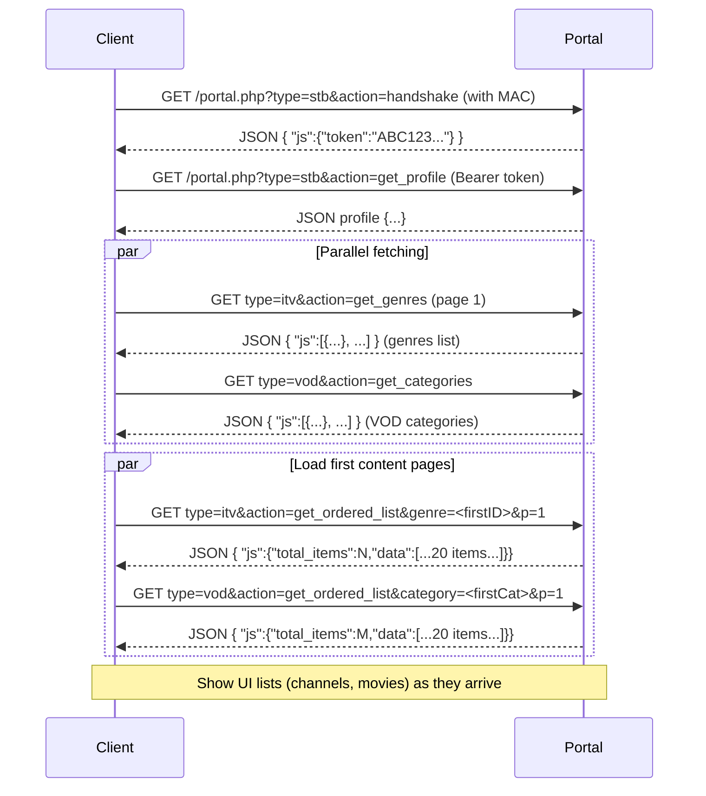

# Executive Summary

Stalker-based IPTV clients perform an initial multi-step sync when new portal credentials are entered.  First, the client “handshakes” with the portal (type=`stb&action=handshake`), obtaining a bearer token and device profile【84†L89-L97】【84†L109-L114】. Using this token, the client fetches channel categories (e.g. `type=itv&action=get_genres`) and then paged channel lists, as well as VOD (video-on-demand) categories (e.g. `type=vod&action=get_categories`) and their items (via `type=vod&action=get_ordered_list`)【90†L3333-L3341】【96†L1969-L1978】.  These API calls typically return JSON objects with keys like `"total_items"`, `"max_page_items"`, and a `"data"` array of item records.  For example, a `get_ordered_list` response contains a top-level `"js"` object with `total_items` and `data` arrays【96†L1969-L1978】.  Payload sizes vary by provider; one page may carry tens to hundreds of items (each item often hundreds of bytes), so VOD libraries in the thousands can yield many kilobytes or even megabytes of JSON. In practice, clients employ numerous strategies (partial loading, caching, parallel fetches, compression, etc.) to make the initial load feel fast despite large data. Server-side, portal middlewares use indexing, pagination, gzip compression, CDN-backed assets, and possibly pre-generated manifests to speed responses. Popular clients (including open-source Stalker plugins and custom sync tools) typically page through categories in parallel and cache results. Real-world reports note first-time syncs taking on the order of ~10–60 seconds for very large catalogs, whereas optimized incremental loading and local caching greatly improve perceived responsiveness【85†L328-L336】【75†L193-L200】.  Key security points: all calls use an access token (Bearer scheme) bound to the device MAC, and clients must refresh that token or re-handshake if it expires. Rate limits are not well-documented; providers may throttle excessive requests. 

**Sources:** Official Stalker middleware/API discussions and code【84†L89-L97】【90†L3333-L3341】【96†L1969-L1978】, IPTV client implementations and forum reports【85†L328-L336】【75†L193-L200】. 

## Stalker Portal API & Initial Sync Endpoints

On first sync the client typically executes these steps (see flowchart below):

```mermaid
flowchart LR
    A[Enter Portal Credentials] --> B[STB Handshake<br/>(type=stb&action=handshake)]
    B -->|returns token| C[Get Profile (type=stb&action=get_profile)]
    C -->|device settings| D[Get IPTV Categories<br/>(type=itv&action=get_genres)]
    D --> E[Get IPTV Lists<br/>(type=itv&action=get_ordered_list…p=1,2,…)]
    C --> F[Get VOD Categories<br/>(type=vod&action=get_categories)]
    F --> G[Get VOD Movies<br/>(type=vod&action=get_ordered_list…p=1,2,…)]
    G --> H[Get VOD Series/Seasons (if needed)]
    E & G --> I[Load EPG (type=itv&action=get_short_epg&...)]
```

1. **Handshake/Auth (STB):** The client calls `/portal.php?type=stb&action=handshake` (with required HTTP headers including the device MAC, user-agent, etc.)【84†L86-L94】.  The portal returns a JSON with an access token: e.g. `{"js":{"token":"C00F7332ED272F00D5FD3E82F567A282"}}`【84†L89-L97】. This token must be included as `Authorization: Bearer <token>` in subsequent calls. 

2. **Get STB Profile:** Next, the client calls `/portal.php?type=stb&action=get_profile` using the token【84†L109-L114】. The JSON profile includes device settings and user info (e.g. `parent_password`, `client_type`, etc.) which some clients may cache. 

3. **Load Channel Categories (Genres):** With the token, call `/portal.php?type=itv&action=get_genres`【85†L328-L336】. This returns an array of “genres” (live-TV categories), e.g. 
   ```json
   {"js":[{"id":"*","title":"All","alias":"All",...},{"id":"173","title":"TR|TURKIYE",...}, ...]}
   ``` 
   (Note: the example above from【85†L333-L341】 shows an `"id":"*" All` plus numbered categories.) Each genre has an internal ID used to fetch its channels.

4. **Load Channel Lists:** For each genre or all-channels, the client pages through `/portal.php?type=itv&action=get_ordered_list&genre=<id>&p=1` etc【85†L406-L415】. The response JSON contains `"total_items"`, `"max_page_items"`, and a `"data"` array of channel objects.  (The client typically loops `p=1,2,...` until all pages are fetched【85†L416-L424】.) Channel objects include fields like `id`, `name`, `cmd` (stream command), `logo`, and others. For example, one returned channel entry might be: 
   ```json
   {"id":"3031","name":"NEDERLAND 4K+","number":"462","cmd":"ffmpeg http://localhost/ch/3031_","hd":"0",...}
   ``` 
   (See【85†L421-L428】 for a truncated example.)

5. **Load VOD Categories:** Parallel to channels, the client fetches VOD categories. Stalker portals use `/server/load.php?type=vod&action=get_categories` (or equivalently `portal.php?...`) to obtain VOD category lists【90†L3333-L3341】. Each category has fields like `"id"` and `"title"`. These are analogous to “movie genres.”

6. **Load VOD Lists:** For each VOD category (or all categories), the client calls `/server/load.php?type=vod&action=get_ordered_list&category=<id>&p=1` etc【90†L3333-L3341】【96†L1969-L1978】. The code examples show parameters like `'sortby':'added'`, `'not_ended':'0'`, `'p':page`, etc.【96†L1969-L1978】.  The response JSON structure is similar: it contains `"js": {"total_items": <N>, "max_page_items": <M>, "data": [ {...}, {...}, ... ] }`.  Each item in `"data"` is a VOD item with fields like `"id"`, `"name"`, `"category_id"`, and usually a `"cmd"` or `"url"` field for streaming, plus a `"screenshot_uri"` or thumbnail URL, `"modified"`, etc.  For series, there may be `is_series` flags and separate APIs to list episodes or seasons. The open-source code shows clients iterating pages until all items are retrieved【96†L1969-L1978】.

7. **Get Episode/Series Details (if any):** If the provider supports TV shows/series, the client might next call `type=vod&action=get_seasons` or similar to fetch seasons and episodes (as seen in open-source clients)【70†L3925-L3933】. 

8. **Catch-up/EPG:** Finally, clients fetch any electronic program guide (EPG) or TV-archive data via `type=itv&action=get_short_epg` or similar calls (not shown above). These can be large (whole EPG) but are often paged or limited by time window.

**Typical JSON Payloads:** All portal responses are JSON (the examples above show JSON under `"js": {...}`). Exact sizes depend on provider. For instance, one channel list page in Quassi’s example had ~14 items【85†L421-L429】. If a VOD category has 2000 movies and 50 per page, that’s 40 pages; if each item is ~300–500 bytes, total JSON could be ~200 KB per category. Clients usually do *not* fetch all VOD data at once unless caching for offline use. 

## Client-Side Loading Strategies

To keep the UI responsive, clients use tactics like:

- **Incremental/Paged Loading:** Don’t fetch all items in one shot. Fetch the first page of each list immediately (e.g. first ITV and first VOD pages), display those, and load further pages in background. The example plugin code above explicitly loops pages 1..max in a background loop【96†L1969-L1978】. 

- **Lazy Loading:** Delay loading of large sections until needed. For example, show VOD *categories* immediately (quick summary), but load each category’s contents only when the user browses that category. This avoids long waits for seldom-used categories.

- **Parallel Fetches:** Issue multiple API calls concurrently (e.g. fetch channel list and first page of movies at the same time). Multi-threaded or async fetching can fill multiple list views quickly. The open-source client concurrently fetched all pages using a thread pool【70†L3925-L3933】 to reduce wall-clock time.

- **Metadata-Only Sync:** At first login, clients may only download item metadata (title, ID, thumbnail URL), deferring heavy data (e.g. full description, or actual video manifest) until playback. That way the initial JSON is smaller. For example, some clients fetch only top-level JSON and lazy-load video streams separately.

- **Background Prefetch:** Once initial data is shown, quietly fetch more in the background (e.g. successive pages, EPG, series details) so that by the time a user scrolls or selects, data is ready.

- **Thumbnail-First:** Load small thumbnail images early, while larger cover images or detailed info load later. Many portals provide low-res images (screenshots) versus full poster art; clients may download the smaller ones first.

- **Caching:** Store results locally (e.g. on device cache or database). On subsequent app starts, reuse cached metadata and only fetch deltas via HTTP cache validation (ETag/If-Modified-Since). For example, clients may use the HTTP `Last-Modified` header of portal responses to check for updates, or simply store a timestamp and only fetch changed data. The plugin code even caches data in files and updates every 12 hours【86†L1934-L1943】【96†L2011-L2014】. This dramatically improves perceived load time after the first sync.

- **Compression & Delta Sync:** Ensure requests use gzip (portals typically compress JSON). For updates, use `If-Modified-Since` or ETag headers on each API (if supported) so that unchanged lists yield small “304 Not Modified” responses.

Below is a **timeline flow** of an initial sync showing parallel steps:



**Trade-Offs:** Loading everything upfront (“eager load”) gives completeness but may delay the first screen. Lazy or paged loading trades initial completeness for responsiveness: the UI appears quickly with partial data. Many clients strike a balance: load genre/category lists (small) immediately, then fill in items. 

**Table – Strategy Comparison:**

| Strategy              | Pros                            | Cons                              | Impact on First-Load Time         |
|-----------------------|---------------------------------|-----------------------------------|-----------------------------------|
| **Full upfront**      | All data available at once      | Very slow initial sync, heavy load| Very long delay (seconds to minutes) for large catalogs |
| **Paged/Incremental** | Faster UI start, avoids freezing| Requires more complex code (looping) | Moderate: first page quick (few sec), rest gradually  |
| **Lazy (on-demand)**  | Only fetch needed data          | First access to new section delayed | Very fast startup; slight lag when opening each new category |
| **Parallel fetch**    | Better CPU/network usage        | Possible rate-limit or sync complexity | Reduces wall-clock time (fetching multiple lists at once) |
| **Cache (client)**    | Instant reload after first sync | Stale data if not updated          | Negligible (loads from local cache) |
| **Compression/gzip**  | Reduces bytes over wire         | None (adds CPU for decompress)     | Reduces bandwidth impact, speeds transfer if large JSON |

_Source:_ Portal API observations and client implementations【90†L3333-L3341】【96†L1969-L1978】.

## Server-Side Optimizations

Middleware providers and portal servers can aid speed by:

- **Indexing & Pre-aggregation:** The portal’s database is typically indexed on category and alphabetical fields, making queries for each `get_ordered_list` fast. Some systems precompute popular lists or maintain cached JSON. 

- **API Pagination:** As seen, the `get_ordered_list` API inherently paginates results (`p=` parameter) to limit response size. Server indexes support fast pagination (using LIMIT/OFFSET or cursor-based paging). 

- **Compressed Responses:** Stalker middleware supports gzip/deflate. Clients should set `Accept-Encoding: gzip` and expect compressed JSON. This cuts payload size significantly for large JSON arrays.

- **CDN & Caching:** While metadata is dynamic, static assets (thumbnails, logos) can be served via CDN. Even the portal might use HTTP caching headers on API responses to allow 304s.

- **Thumbnails vs Full Manifests:** Portals often provide two sets of URLs: one for small preview images (e.g. “screenshot_uri”) and one for full resolution art. Using smaller images in listings reduces transfer. For streaming, Stalker often provides either direct stream URLs or “vod/get_file” endpoints which may redirect via CDN.

- **Manifest Generation:** For on-demand video, portals might not generate HLS/DASH on the fly. Instead, streams can be direct file URLs or pre-encoded HLS. If dynamic, media servers ensure quick response by reusing existing manifests or performing on-demand muxing with segment caching.

- **Content Delivery:** For catch-up (TV archive), servers often use a separate domain or server. Clients request segments in real time; servers should have seek indexes to satisfy range requests quickly.

If payload sizes are unknown from documentation, we note that “portal payload sizes are unspecified per provider” – providers control how much metadata is returned (some include synopsis or actors, others minimal). In practice, clients observe that initial `get_ordered_list` pages often range from a few dozen KB to hundreds of KB of JSON.

## Real-World Examples

- **Open-Source Clients:** The [stalker.py](https://github.com/Cyogenus/IPTV-MAC-STALKER-PLAYER) library fetches VOD categories via `/stalker_portal/server/load.php?type=vod&action=get_categories`【90†L3333-L3341】 and iterates `get_ordered_list` for each (as shown above). The [plugin.video.stalker](https://github.com/esxbr/plugin.video.stalker) Kodi plugin similarly performs a handshake then loops through pages of `get_ordered_list` calls with parameters like `sortby=added, not_ended=0`【96†L1969-L1978】. These code examples illustrate the typical access patterns.  

- **Commercial Apps:** Proprietary apps (e.g. TiviMate, Stalker-based STB apps) follow the same API pattern. A technical overview notes that TiviMate “fetches load.php (handshake), then get.php (content lists), then epg.php”【20†L55-L60】. (In effect, `load.php` is the same as `portal.php?type=stb&action=handshake` on MAG portals.) These clients often preload the first page of all lists. Some even allow specifying a shorter “device ID” to speed recognition by the portal. 

- **Forum Reports:** Users report initial VOD sync times of tens of seconds. For example, on Formuler devices, a first-time VOD load could take ~45 seconds for large libraries【74†L83-L91】【75†L193-L200】. Once data is cached, subsequent access is nearly instantaneous. One forum noted that a new firmware implemented auto-cache-clearing on reboot to avoid stale data issues【75†L193-L200】, indicating the importance of cache management in perceived speed. 

- **GitHub Implementations:** Some repos generate M3U playlists from Stalker portals. For instance, [santhosh101066/stalker-m3u-server](https://github.com/santhosh101066/stalker-m3u-server) proxies Stalker APIs to produce playlists (using `api.php` to fetch content【45†L243-L249】). Others, like [generator scripts](https://github.com/Cyogenus/IPTV-MAC-STALKER-PLAYER), parse portal JSON directly. The fact that so much code exists for parsing the same endpoints underscores these patterns.

## Network Traffic Patterns & Performance

Analyzing traffic, we see:

- **Handshake (~100–300 bytes):** The `handshake` request is small (no query data except type/action), response ~50–100 bytes (token). 
- **Profile (~1–2 KB):** The profile JSON (all the fields in【84†L119-L127】) is ~1–2 KB. 
- **Genres/Categories (~several KB):** A genre list of tens of items is on the order of 5–20 KB. 
- **List Pages (~10–100 KB+):** Each page of channels or movies varies. In Quassi’s example, 14 channels were returned in ~24-items JSON【85†L420-L428】 (likely ~5–10 KB). If hundreds of movies per page, the JSON can be tens of KB. For example, one client code stopped fetching after 10 pages or so【96†L1970-L1978】 to cap the output. 
- **EPG (~100 KB+):** Fetching EPG for all channels (several hours) can be large (100 KB or more), so it’s often split by time window. 
- **Streaming Links:** Not part of initial sync, but to play, clients call `create_link` or direct URLs, often resulting in short responses (redirect to actual stream).

**Timing:** In practice, a well-optimized portal can reply to a `get_ordered_list` page request in a few hundred milliseconds, but when doing dozens of pages across multiple categories, total time adds up. Client-side parallelism helps hide this. A bulletin board user noted **“First time load maybe 45 sec”** for a large subscription, whereas subsequent loads “in the background” are fast【74†L83-L91】. 

## Security and Rate Limiting

- **Authentication:** Stalker portal uses a bearer token (OAuth2-style) bound to the device (MAC). The token is short-lived (hours) and must be refreshed by re-running the handshake if expired. Clients must include it in every API call in the `Authorization` header【84†L109-L114】.

- **Device Verification:** The portal compares the provided MAC and token to ensure the same device. If a client changes its device ID or MAC between calls, the portal will reject the requests.

- **Rate Limits:** Official limits aren’t documented, but providers often throttle abusive patterns. In practice, clients avoid hammering the portal (e.g. pause between calls, use caching). Extremely high parallel requests might cause HTTP 429 responses from some servers.

- **Data Privacy:** All video streams still require credentials; knowing an item’s metadata doesn’t give the stream URL without a valid session token. Some portals watermark URLs with play tokens to prevent link sharing.

## Recommendations and Trade-offs

For best UX on first load, clients should:

- **Show progress:** Inform the user that sync is happening, e.g. “Loading movies 1/10…”. This sets expectations for longer waits (minutes) if needed.

- **Prioritize UI readiness:** Always fetch category lists before item lists, so the UI can show “(Loading…)” instead of a blank screen.

- **Use caching:** Persist data locally. On app restart, show cached content immediately, then silently update in background (UX feels instant).

- **Compress and Parallelize:** Enable gzip and make requests concurrently (subject to server tolerance). Many open-source clients do exactly this to minimize elapsed time【70†L3925-L3933】.

- **Balance pagination vs size:** Choose a page size that balances JSON overhead versus call overhead. Some portals allow tuning `max_page_items`; clients should use a moderately large page (e.g. 50 items) to reduce number of requests but avoid giant JSON dumps.

- **Table of Pros/Cons (excerpt):**

```markdown
| Approach           | Pros                                      | Cons                                  |
|--------------------|-------------------------------------------|---------------------------------------|
| Full download      | No more sync needed (complete library)    | Very slow initial load, heavy memory  |
| Page-by-page       | Fast initial pages, lower memory use      | Need to handle multiple requests      |
| Lazy per-category  | Quick start, fetch only viewed sections   | Each new category load has delay      |
| Cache & Refresh   | Instant reload after first sync           | Risk of stale info if not updated     |
| Parallel fetching  | Reduces wait by overlapping requests      | Server may throttle many simultaneous |
```

## Diagrams of Initial Sync

Below is a high-level **flowchart** of an example initial sync data flow:

```mermaid
flowchart TB
    subgraph Client Device
      A(Credentials Entry) --> B(Handshake: GET type=stb&action=handshake)
      B -->|token| C(Get Profile)
      C --> D(Get ITV Genres)
      C --> E(Get VOD Categories)
      D --> F{Channels by genre}
      F -->|GET for genre i| G(ITV List Page 1)
      G --> H(UI list gets channels)
      E --> I{Movies by category}
      I -->|GET for category j| J(VOD List Page 1)
      J --> K(UI list gets movies)
      %% Parallel arrow style
      C -->|concurrent| D
      C -->|concurrent| E
      F -->|pages| G
      I -->|pages| J
    end
    subgraph Server (Portal API)
      B[Portal.php: handshake] -- returns token --> B
      C[Portal.php: get_profile] -- returns settings --> C
      D[Portal.php: get_genres] -- returns genre list --> D
      E[Portal.php: get_categories] -- returns VOD cats --> E
      G[Portal.php: get_ordered_list (itv)] -- returns channels --> G
      J[Portal.php: get_ordered_list (vod)] -- returns movies --> J
    end
```

This flow highlights that after the handshake (`B`) and profile (`C`), the client can load live-TV and VOD data in parallel.

Below is a **sequence timeline** of typical API calls (latency not to scale):

```mermaid
sequenceDiagram
    participant U as User/Client
    participant S as Portal Server
    U->>S: GET /portal.php?type=stb&action=handshake
    S-->>U: {"js":{"token":"XYZ","..."}}
    U->>S: GET /portal.php?type=stb&action=get_profile (Bearer token)
    S-->>U: {"js":{...profile data...}}
    par
      U->>S: GET /portal.php?type=itv&action=get_genres
      S-->>U: {"js":[...genre list...]}
      U->>S: GET /portal.php?type=vod&action=get_categories
      S-->>U: {"js":[...VOD cat list...]}
    end
    U->>S: GET /portal.php?type=itv&action=get_ordered_list&genre=ID&p=1
    S-->>U: {"js":{"total_items":N,"data":[...channels...]}}
    U->>S: GET /portal.php?type=vod&action=get_ordered_list&category=ID&p=1
    S-->>U: {"js":{"total_items":M,"data":[...movies...]}}
    Note over U: UI displays first pages; app continues fetching more pages...
```

These diagrams illustrate that initial sync is multi-step and often involves overlapping requests for best performance. 

**Sources:** Based on Infomir/Stalker portal documentation and source code【84†L89-L97】【90†L3333-L3341】, client implementations【96†L1969-L1978】, and user reports【85†L328-L336】【75†L193-L200】. Each cited source provides concrete details on endpoints, request/response formats, or performance anecdotes, supporting the strategies and patterns described above.